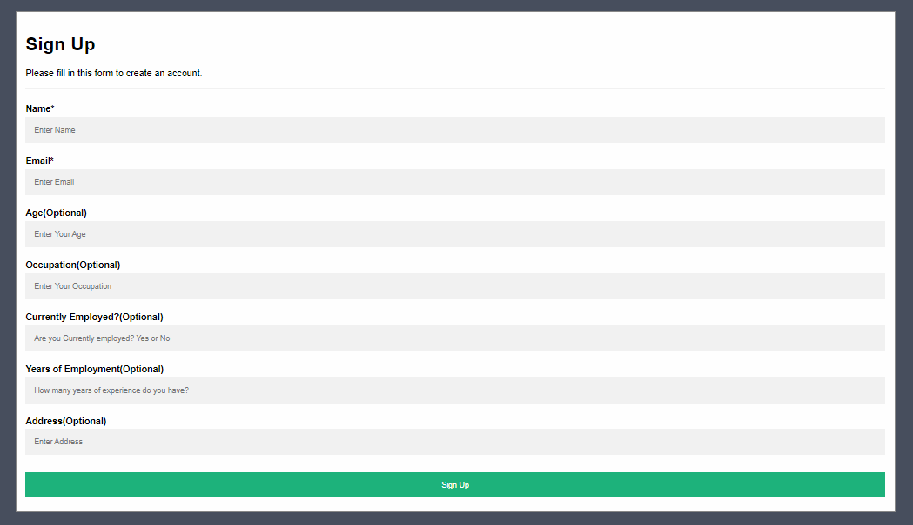
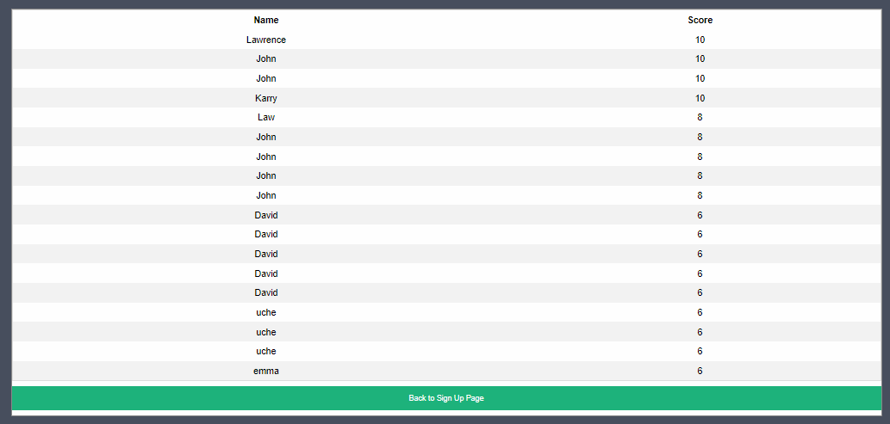

# afa-ini# Build a simple Score Application.

A simple Web App to score a users signup information. Details:
Build a signup form that accepts:
- Name, email (unique), age, occupation, currently employed, address, how ManyYearsEmployed (use any data types of your choosing for the fields.)
- Perform Form Validation, Required fields include name and email
- You are to assume other fields as optional fields. Score the form information based on the existence and characteristics of the optional fields.

### Explanation:

Optional Fields (which include age, occupation, address etc.) are to each be assigned weights which make up to a total of 10.

 

Example: if no age - score of 0, if no address score of 0. If how ManyYearsEmployed < 1 score can be enumerated.
**Hint:** Enumerate values for yearsOfEmployment.

_N.B_

A Required validation, if Age is less than 18 total weight should be 0.

### Question

Do any design of your choice for the frontend, and just a 2 page implementation
- 1 for the signup
- 2 for the list of users arranged in order of score values.

## Built with
- Frontend: React.js
- Backend: Node.js

## Clone Project

[Build a simple Score Application](https://github.com/Emmy-github-webdev/afa-ini)

## Run Project
After cloning the project
- Cd afa-ini
- Run _npm install_
- Cd client
- Run _npm install_
- Change directory to _afa-ini_ directory
- Run the project cocurrently _npm run dev_

## Authors

👤 **Emmanuel Ogah**

- GitHub: [@githubhandle](https://github.com/githubhandle)
- Twitter: [@twitterhandle](https://twitter.com/twitterhandle)
- LinkedIn: [LinkedIn](https://linkedin.com/in/linkedinhandle)

# Show your support

Give a ⭐️ if you like this project!

